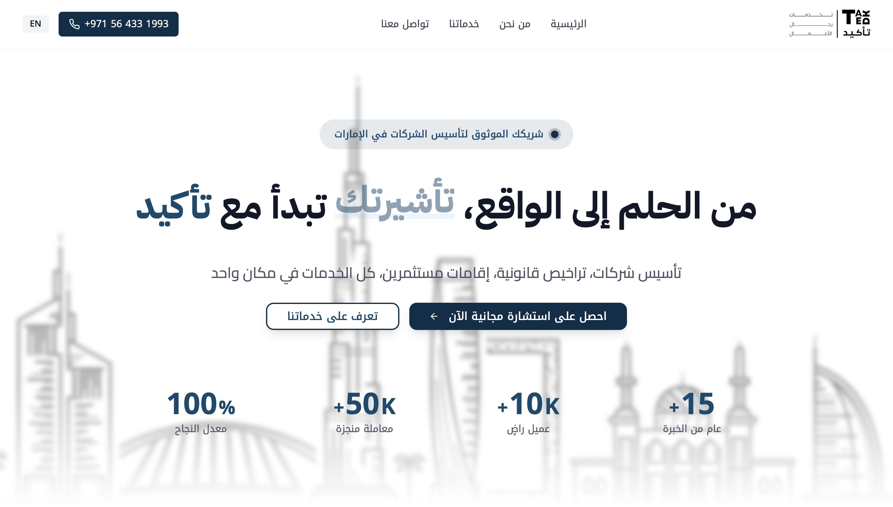

<h1 align="center">🚀 TAKED – Government Services Platform (UAE)</h1>

<p align="center">
  A sleek, fully responsive web application providing a suite of business & government services in the UAE.<br/>
  Built with modern frontend technologies, designed with elegance, and optimized for performance.
</p>

<p align="center">
  <a href="https://github.com/USM279/taked_web"></a>
  <a href="https://obada.tech"></a>
</p>

---

## 🧩 Tech Stack

| Category      | Tech Used                                                                 |
|---------------|---------------------------------------------------------------------------|
| 🧠 Framework  | [React](https://react.dev/) + [TypeScript](https://www.typescriptlang.org/) |
| ⚡️ Bundler    | [Vite](https://vitejs.dev/)                                                |
| 🎨 Styling    | [Tailwind CSS](https://tailwindcss.com/) + Custom Utility Classes          |
| ✉️ Forms      | [EmailJS](https://www.emailjs.com/) - client-side email integration        |
| 🚀 Hosting    | [Vercel](https://vercel.com/) - instant deployment + global CDN            |

---

## 💎 Features

- ⚡️ **Blazing Fast** – Powered by Vite and deployed on Vercel  
- 📱 **Mobile-First Design** – Clean layout across all screen sizes  
- 🖼️ **Elegant UI** – Inspired by luxury branding in the UAE  
- ✉️ **Integrated Contact Form** – With real-time validation & EmailJS  
- 💡 **SEO Optimized** – Proper meta tags and OG image support  
- 🧩 **Component-Based** – Easy to maintain and extend  

---

## 📸 Preview




---

## 🚀 Run Locally

```bash
git clone https://github.com/USM279/taked_web.git
cd taked_web
npm install
npm run dev

📬 Contact
Feel free to reach out for collaborations, improvements, or just to say hi!
📧 Email: obada.smaisem@gmail.com
🌍 Portfolio: obada.tech
💼 LinkedIn: linkedin.com/in/obada-smaisem
